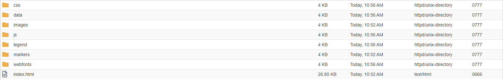
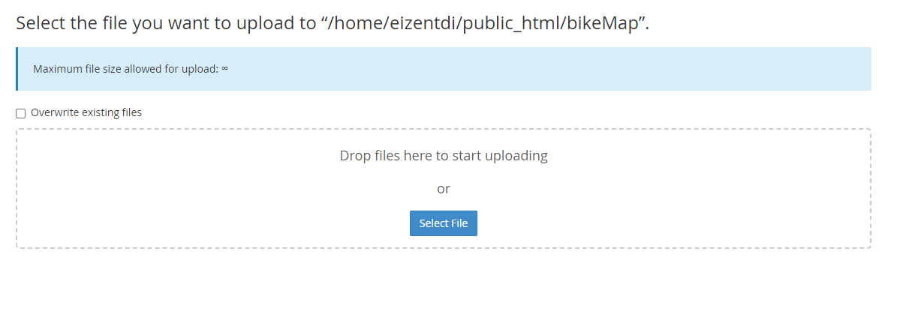
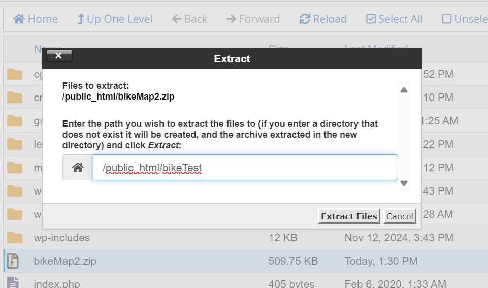

# Domain of One's Own Web Map Hosting Tutorial 

To follow this tutorial you will need:

1. *A Domain of One's Own Account* (for help setting up your account, go to [this Ask Athena article](https://askathena.brynmawr.edu/help/domain-of-ones-own-get-started))
2. *Exported leaflet webmap from QGIS* (follow [this qgis2web tutorial](https://www.qgistutorials.com/en/docs/3/web_mapping_with_qgis2web.html) until step 30). 

## Log into Domain of One's Own
Once you have your exported qgis2web files in one folder save on your computer, zip all the files into one folder. This zipped folder will be uploaded to your domain. The exported project should contain an index.html file, as well as other folders including css, js, legends, markers, webfonts, images and data. Once you have all your files in order, log into your Bryn Mawr Domain of One's own account (see image below). 

## Scroll down to the File section on DoOO
The screen should look like this:

Navigate to the File Manager.

## Go to the public_html folder
After clicking on the File Manager section, it should bring you to the File Manager dashboard:

Click on the public_html section of the dashboard. This folder contains all of the pages that are public and available on the web on your domain. For example, if you have WordPress or Scalar applications connected to your account, they folders containing that data will show up here. Additionally, the names of the folders that you create within the public_html section become part of the public url where people will access your sites. For example, in the above image, you can see a folder called 'groningen', this folder corresponds to the page eizent.digital.brynmawr.edu/groningen/. 

* **Note** * eizent is the domain name that I have chosen, so your url path will be domainName.digital.brynmawr.edu/folderName/.

## Upload your zipped folder
In the public_html folder, click the upload button on the top panel. Select (or drag) your zipped folder that contains the exported map information to the upload spot.

Once you upload your zipped file, it will automatically go into your public_html after you see it has uploaded 100 percent.

## Extracting files
Navigate to the zipped folder in your public_html page, and right click to extract. 

Here, you can extract the files directly into the public_html (or you can create a new folder with a name to hold your files). Now, the qgis2web files should be in an unzipped folder, and you can rename the folder. Remember, the name of your folder becomes part of the URL, so make sure to name it something simple and informative. 

## Look at your map!
Your map should now be displayed at domainName.digital.brynmawr.edu/folderName!

